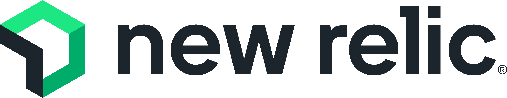

# Steadybit extension-newrelic

A [Steadybit](https://www.steadybit.com/) extension for [New Relic](https://newrelic.com).

Learn about the capabilities of this extension in our [Reliability Hub](https://hub.steadybit.com/extension/com.steadybit.extension_newrelic).

## Configuration

| Environment Variable                                  | Helm value                             | Meaning                                                                                                                            | Required | Default |
|-------------------------------------------------------|----------------------------------------|------------------------------------------------------------------------------------------------------------------------------------|----------|---------|
| `STEADYBIT_EXTENSION_API_BASE_URL`                    | `newrelic.apiBaseUrl`                  | The New Relic API Base Url, like 'https://api.newrelic.com' or 'https://api.eu.newrelic.com'                                       | yes      |         |
| `STEADYBIT_EXTENSION_API_KEY`                         | `newrelic.apiKey`                      | The New Relic [API Key](https://docs.newrelic.com/docs/apis/intro-apis/new-relic-api-keys/), Type: USER                            | yes      |         |
| `STEADYBIT_EXTENSION_INSIGHTS_COLLECTOR_API_BASE_URL` | `newrelic.insightsCollectorApiBaseUrl` | The New Relic Ingest API Base Url, like 'https://insights-collector.newrelic.com' or 'https://insights-collector.eu01.nr-data.net' | yes      |         |
| `STEADYBIT_EXTENSION_INSIGHTS_COLLECTOR_API_KEY`      | `newrelic.insightsCollectorApiKey`     | The New Relic [Ingest API Key](https://docs.newrelic.com/docs/apis/intro-apis/new-relic-api-keys/), Type: INGEST - LICENSE         | yes      |         |

The extension supports all environment variables provided by [steadybit/extension-kit](https://github.com/steadybit/extension-kit#environment-variables).

## Installation

### Kubernetes

Detailed information about agent and extension installation in kubernetes can also be found in
our [documentation](https://docs.steadybit.com/install-and-configure/install-agent/install-on-kubernetes).

#### Recommended (via agent helm chart)

All extensions provide a helm chart that is also integrated in the
[helm-chart](https://github.com/steadybit/helm-charts/tree/main/charts/steadybit-agent) of the agent.

You must provide additional values to activate this extension.

```
--set extension-newrelic.enabled=true \
--set extension-newrelic.newrelic.apiBaseUrl={{YOUR-API-BASE-URL}} \
--set extension-newrelic.newrelic.apiKey={{YOUR-API-KEY}} \
--set extension-newrelic.newrelic.insightsCollectorApiBaseUrl={{YOUR-INSIGHTS-COLLECTOR-API-BASE-URL}} \
--set extension-newrelic.newrelic.insightsCollectorApiKey={{YOUR-INSIGHTS-COLLECTOR-API-KEY}} \
```

Additional configuration options can be found in
the [helm-chart](https://github.com/steadybit/extension-newrelic/blob/main/charts/steadybit-extension-newrelic/values.yaml) of the
extension.

#### Alternative (via own helm chart)

If you need more control, you can install the extension via its
dedicated [helm-chart](https://github.com/steadybit/extension-newrelic/blob/main/charts/steadybit-extension-newrelic).

```bash
helm repo add steadybit-extension-newrelic https://steadybit.github.io/extension-newrelic
helm repo update
helm upgrade steadybit-extension-newrelic \
    --install \
    --wait \
    --timeout 5m0s \
    --create-namespace \
    --namespace steadybit-agent \
    --set newrelic.apiBaseUrl={{YOUR-API-BASE-URL}} \
    --set newrelic.apiKey={{YOUR-API-KEY}} \
    --set newrelic.insightsCollectorApiBaseUrl={{YOUR-INSIGHTS-COLLECTOR-API-BASE-URL}} \
    --set newrelic.insightsCollectorApiKey={{YOUR-INSIGHTS-COLLECTOR-API-KEY}} \
    steadybit-extension-newrelic/steadybit-extension-newrelic
```

### Linux Package

Please use
our [agent-linux.sh script](https://docs.steadybit.com/install-and-configure/install-agent/install-on-linux-hosts)
to install the extension on your Linux machine. The script will download the latest version of the extension and install
it using the package manager.

After installing, configure the extension by editing `/etc/steadybit/extension-newrelic` and then restart the service.

## Extension registration

Make sure that the extension is registered with the agent. In most cases this is done automatically. Please refer to
the [documentation](https://docs.steadybit.com/install-and-configure/install-agent/extension-registration) for more
information about extension registration and how to verify.

## Version and Revision

The version and revision of the extension:
- are printed during the startup of the extension
- are added as a Docker label to the image
- are available via the `version.txt`/`revision.txt` files in the root of the image
